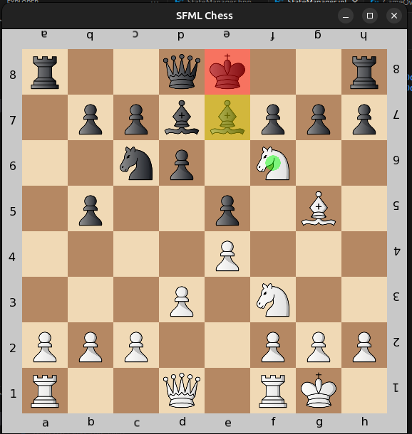
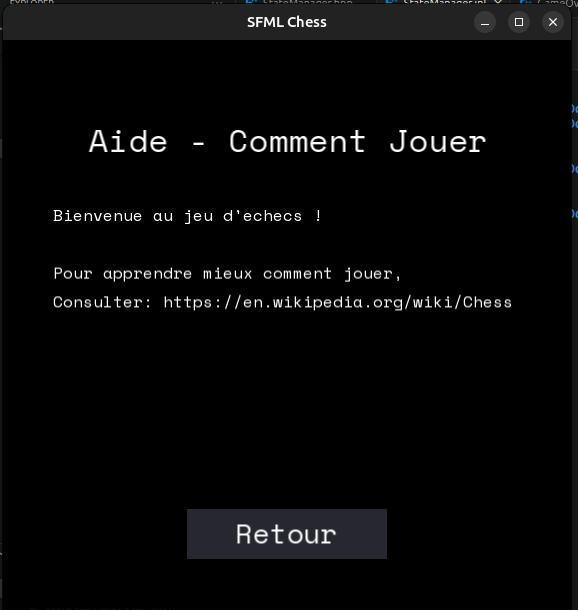
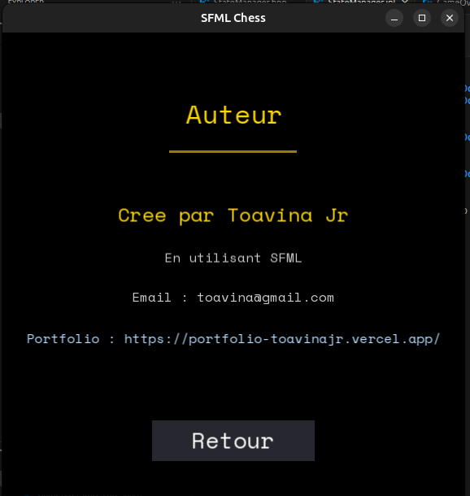
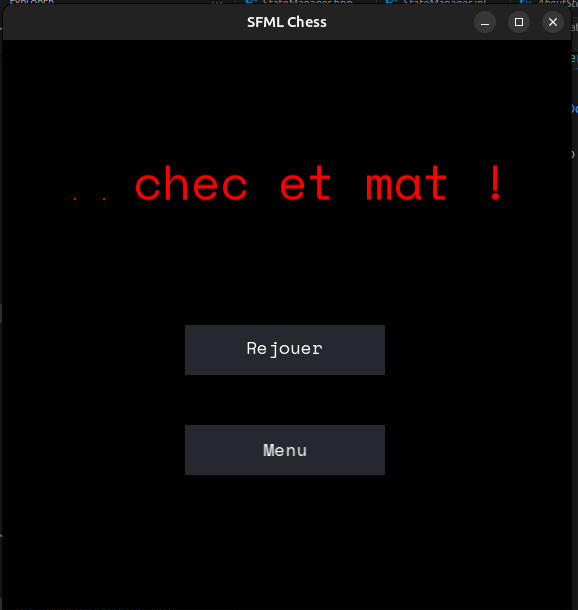

# ♟️ Chess Game – C++ & SFML & Doxygen

**Un jeu d'échecs développé en C++ avec SFML, doté d’une interface intuitive et d’une documentation complète générée avec Doxygen.**

---

## ✨ **Fonctionnalités**

* ✅ Jeu d’échecs complet avec règles officielles (roque, promotion, échec et mat, etc.)
* ✅ Interface graphique avec **SFML**
* ✅ Gestion des états via un système de **StateManager** (Menu, Partie, Aide, À propos, Écran de fin)
* ✅ Gestion optimisée des ressources (Textures, Polices)
* ✅ Documentation générée automatiquement avec **Doxygen**
* ✅ Compatible **Linux** (Ubuntu testé) et Windows

---

## 🖼️ **Captures d’écran**

### Menu Principal


### Plateau de jeu



### Écran d’Aide



### Écran "À propos"



### Fin de Partie



---

## 📥 **Installation**

### 1. **Prérequis**

* **CMake ≥ 3.10**
* **SFML ≥ 2.6**
* **G++ ≥ 11 (recommandé)**
* **Doxygen** (facultatif pour la documentation)

### 2. **Téléchargement de SFML**

* **Linux (Ubuntu)** :

```bash
sudo apt update
sudo apt install libsfml-dev
```

* **Windows** : [Télécharger SFML ici](https://www.sfml-dev.org/download.php)

### 3. **Cloner le projet**

```bash
git clone https://github.com/ToavinaJr/Jr-Chess-SFML.git
cd chess-sfml
```

### 4. **Compilation**

```bash
mkdir build && cd build
cmake ..
make
```

### 5. **Exécution**

```bash
./Chess
```

---

## 📂 **Structure du projet**

```text
.
├── assets/          # Ressources graphiques (pièces d’échecs, polices)
├── docs/            # Documentation générée par Doxygen
├── include/         # Fichiers d’en-tête (.hpp)
├── screenshots/     # Captures d’écran pour le README
├── source/          # Code source (.cpp)
├── CMakeLists.txt   # Fichier de configuration CMake
├── Doxyfile         # Configuration pour Doxygen
└── README.MD        # Ce fichier
```

---

## 📖 **Documentation**

Une documentation complète du code est disponible dans le dossier [`docs/html`](./docs/html).
Pour la régénérer :

```bash
doxygen Doxyfile
```

Puis ouvrez :

```bash
xdg-open docs/html/index.html
```

dans votre navigateur.

---

## 🛠️ **Contribuer**

Les contributions sont les bienvenues !

* **Forkez** le projet
* **Créez** une branche : `git checkout -b feature/ma-fonctionnalite`
* **Soumettez** une Pull Request

---

## ✅ **À Faire / Améliorations futures**

* ♟️ Ajout d’un mode multijoueur en ligne
* ♟️ IA pour jouer contre l’ordinateur
* ♟️ Historique des coups et export en PGN

---

### 🔗 **Ressources utiles**

* [📌 Documentation SFML](https://www.sfml-dev.org/documentation/2.6.0/)
* [📌 Doxygen](https://www.doxygen.nl/index.html)
* [📌 Tutoriel CMake](https://cmake.org/cmake/help/latest/guide/tutorial/index.html)

---
